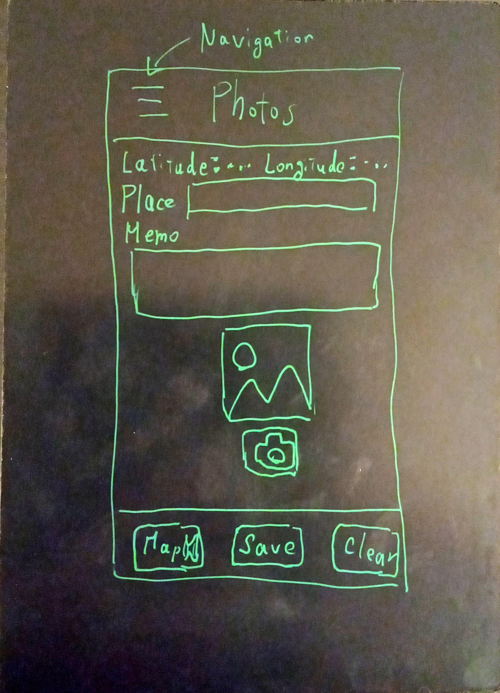

# MY PHOTOS ON REACT

My React exercises

## Motivation

(1) I want to study React.

(2) Last year I studied Low Code Development Platforms (LCDP) such as OutSystem or Mendix. I want to develop something like a handwritten version of such a web app made possible with LCDP: I use React, Express and Postgres SQL with Heroku PaaS instead of LCDP.

## Note

This app is dependent on a REST API server in my other project [heroku-myphotos](https://github.com/araobp/heroku-myphotos).

## Rough sketch of the app UI



## Architecture

I have connected Heroku PaaS to both [react-myphotos](https://github.com/araobp/react-myphotos) and [heroku-myphotos](https://github.com/araobp/heroku-myphotos).

Heroku PaaS builds and deploys these projects automatically at every commit to GitHub.

```
 react-myphotos                    heroku-myphotos
[React web page] --- REST API --- [Express/Node.js]---[Postgres SQL]
- - - - - - - - -                 - - - - - - - - - - - - - - - - -
Static web server                         REST API service
hosted by Heroku                          hosted by Heroku
```

## Running the app locally

```
$ npm start
```

Note: enter "login", "password" and "BASE URL"(URL of the REST API server) on the Login page of the app for the first time.

## Relationship to my other project on GitHub

react-myphotos(frontend) --- REST API --- [heroku-myphotos](https://github.com/araobp/heroku-myphotos)

```
REST API

BaseURL: https://myphotos1088001.herokuapp.com

*** CREATE A RECORD ***
POST /records
{
    "place": "string",
    "memo": "string",
    "latitude": "number",
    "longitude": "number"
}

Its response
{
    "id": "integer"
}

*** UPDATE A RECORD ***
PUT /records/:id
{
    "place": "string",
    "memo": "string",
    "latitude": "number",
    "longitude": "number"
}

*** GET A LIST OF RECORDS ***
GET /records
[{"id": "number", 
  "record":
    {
        "datetime": "string",
        "place": "string",
        "memo": "string",
        "latitude": "number",
        "longitude": "number"
    }
}]

*** GET A RECORD ***
GET /records/:id
{
    "datetime: "string",
    "place": "string",
    "memo": "string",
    "latitude": "number",
    "longitude": "number"
}

*** PUT AN IMAGE ***
PUT /photos/:id
Binary data

*** GET A THUMBNAIL ***
GET /photos/:id/thumbnail
Binary data

*** GET AN IMAGE ***
GET /photos/:id/image
Binary data

*** DELETE A RECORD ***
DELETE /records/:id

*** DELETE RECORDS ***
DELETE /records

Its associated photo is also deleted.

```

## Issues

### async/await in forEach

[Using async/await with a forEach loop](https://stackoverflow.com/questions/37576685/using-async-await-with-a-foreach-loop)

### Leaflet

Loading marker images 

https://stackoverflow.com/questions/65758463/react-leaflet-marker-image-fails-to-load

Remove import "leaflet/dist/leaflet.css"; 

Go to public/index.html and include the CDN hosted leaflet.css:
```
<link rel="stylesheet" href="https://unpkg.com/leaflet@1.7.1/dist/leaflet.css"
  integrity="sha512-xodZBNTC5n17Xt2atTPuE1HxjVMSvLVW9ocqUKLsCC5CXdbqCmblAshOMAS6/keqq/sMZMZ19scR4PsZChSR7A=="
  crossorigin=""/>
```

## References

- W3 schools: https://www.w3schools.com/
- React Tutorial: https://www.w3schools.com/REACT/default.asp
- react-html5-camera-photo: https://www.npmjs.com/package/react-html5-camera-photo
- react-icons: https://react-icons.github.io/react-icons/
- React buildpack for Heroku PaaS: https://github.com/mars/create-react-app-buildpack
    
