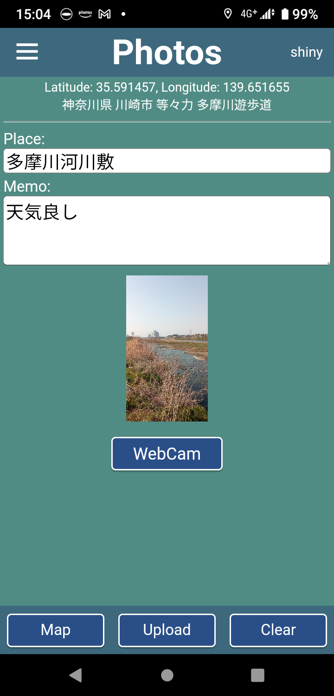

# MY PHOTOS ON REACT (SPA and PWA)

This "learning web app development by doing" project was created on Jan 17, 2022.

- [Frontend] I use React with TypeScript for developing SPA/PWA
- [Backend] I use Spring Boot for developing REST API server with PostgreSQL

## SPA and PWA

- This app runs on Windows, MacOS, Android and iOS.
- This app is dependent on a REST API server in my other project [spring-myphotos](https://github.com/araobp/spring-myphotos).

## UI design

### Rough sketch of home screen


### Implementation of the sketch



## Features

- Camera: HTML5 webcam, mobile native camera and image file uploader
- Photo album: closest order and datetime order
- Location markers on Leaflet-based map 
- 360 photo viewer supporting equirectangular images
- Extraction of datetime and location from JPEG EXIF (performed by the backend)

## Architecture

I have connected Heroku PaaS to both [react-myphotos](https://github.com/araobp/react-myphotos) and [spring-myphotos](https://github.com/araobp/spring-myphotos).

Heroku PaaS builds and deploys these projects automatically at every commit to GitHub.

```
 react-myphotos                         spring-myphotos
[React web page] --- REST API --- [Spring MVC]--[Spring Data]--PostgreSQL
- - - - - - - - -                  - - - - - - - - - - - - - - - - - - - -
Static web server                           REST API service
hosted by Heroku                            hosted by Heroku
```

## Running the app locally

```
$ npm start
```

Note: enter "login", "password" and "BASE URL"(URL of the REST API server) on the Login page of the app for the first time.

## Issues

### async/await in forEach

[Using async/await with a forEach loop](https://stackoverflow.com/questions/37576685/using-async-await-with-a-foreach-loop)

### Leaflet

Loading marker images 

https://stackoverflow.com/questions/65758463/react-leaflet-marker-image-fails-to-load

Remove import "leaflet/dist/leaflet.css"; 

Go to public/index.html and include the CDN hosted leaflet.css:
```
<link rel="stylesheet" href="https://unpkg.com/leaflet@1.7.1/dist/leaflet.css"
  integrity="sha512-xodZBNTC5n17Xt2atTPuE1HxjVMSvLVW9ocqUKLsCC5CXdbqCmblAshOMAS6/keqq/sMZMZ19scR4PsZChSR7A=="
  crossorigin=""/>
```

### Panolens

To avoid type check error, add a file "panolens.d.ts" including the following line:

```
declare module 'panolens';
```

## References

- W3 schools: https://www.w3schools.com/
- React Tutorial: https://www.w3schools.com/REACT/default.asp
- react-html5-camera-photo: https://www.npmjs.com/package/react-html5-camera-photo
- react-icons: https://react-icons.github.io/react-icons/
- React buildpack for Heroku PaaS: https://github.com/mars/create-react-app-buildpack
    
